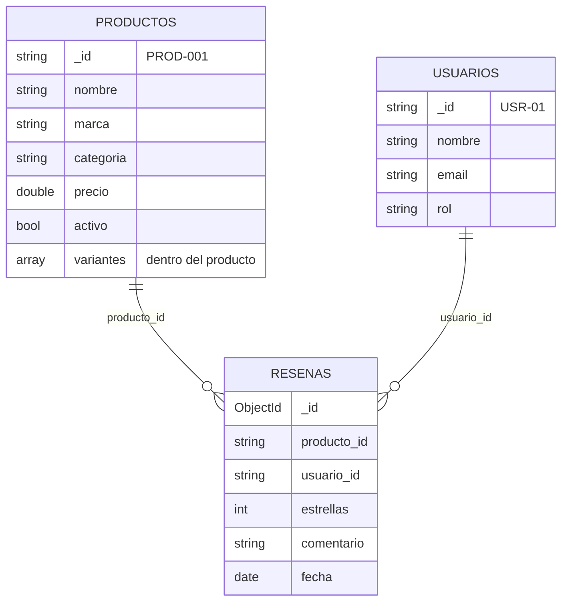

# Práctica 01 · Base de datos documental con MongoDB

**Alumno:** Alejandro Murillo  
**Módulo:** Sistemas de Big Data · UT2  
**Escenario:** Catálogo de una tienda de electrónica

---

## Índice

- [Cómo ejecutarlo](#cómo-ejecutarlo)
- [1. Definir el problema y los accesos](#1-definir-el-problema-y-los-accesos)
- [2. Diseño de las colecciones](#2-diseño-de-las-colecciones)
- [3. Validación e índices](#3-validación-e-índices)
- [4. Consultas y agregación](#4-consultas-y-agregación)
- [5. Copias de seguridad, seguridad y límites](#5-copias-de-seguridad-seguridad-y-límites)
- [6. Revisión](#6-revisión)

---

## Cómo ejecutarlo

### Requisitos

- Docker (yo he usado la imagen `mongo:8.0`, **MongoDB 8.0**)
- No hace falta instalar `mongosh` porque ya viene dentro del contenedor

### Pasos

```bash
# 1. Arrancar MongoDB
docker run -d --name mongo-practica -p 27017:27017 mongo:8.0

# 2. Copiar los scripts dentro del contenedor
docker cp scripts mongo-practica:/scripts

# 3. Ejecutarlos EN ESTE ORDEN
docker exec mongo-practica mongosh --quiet --file /scripts/01-colecciones-validacion.js
docker exec mongo-practica mongosh --quiet --file /scripts/02-datos.js
docker exec mongo-practica mongosh --quiet --file /scripts/03-indices.js
docker exec mongo-practica mongosh --quiet --file /scripts/04-consultas.js
```

El script `01` borra la base de datos y la crea de cero, así que se puede repetir todo las veces que haga falta. La copia de seguridad se explica en [`scripts/05-backup.md`](scripts/05-backup.md).

### Estructura del repositorio

```
PracticaUT2_01_Murillo_Alejandro/
├── README.md                          ← este documento
├── scripts/
│   ├── 01-colecciones-validacion.js   ← crea las colecciones con $jsonSchema
│   ├── 02-datos.js                    ← inserta los datos de prueba
│   ├── 03-indices.js                  ← índices y explain antes/después
│   ├── 04-consultas.js                ← CRUD, preguntas y agregación
│   └── 05-backup.md                   ← copia y restauración
├── docs/
│   ├── modelo.md                      ← diagrama del modelo
│   └── evidencias/                    ← capturas
└── datos/
    └── README.md                      ← de dónde salen los datos
```

---

## 1. Definir el problema y los accesos

### 1.1 Escenario y usuarios

El escenario es una **tienda online de electrónica** (móviles, portátiles, audio, televisores y accesorios) en la que los clientes buscan productos, miran sus variantes (color, capacidad…) y leen las reseñas de otros clientes.

| Usuario | Qué hace |
|---|---|
| **Cliente** | Busca productos por categoría, marca, precio o nombre, mira el stock de cada variante y escribe reseñas |
| **Administrador de la tienda** | Da de alta productos, cambia precios, actualiza el stock y revisa qué productos se están acabando |

### 1.2 Preguntas de negocio

| # | Pregunta |
|---|---|
| P1 | ¿Qué productos hay de una categoría, ordenados por precio? |
| P2 | ¿Qué productos de una marca cuestan entre un precio mínimo y uno máximo? |
| P3 | ¿Qué variantes tiene un producto y cuánto stock queda de cada una? |
| P4 | ¿Cuáles son las últimas reseñas de un producto? |
| P5 | ¿Cuál es la valoración media de cada producto? |
| P6 | ¿Qué productos tienen poco stock (menos de 5 unidades)? |
| P7 | ¿Qué productos contienen una palabra en su nombre (por ejemplo "inalámbrico")? |

### 1.3 Datos que más se leen y se escriben

- **Lo que más se lee:** el catálogo de productos, es decir, buscar productos, ver la ficha y comprobar si hay stock o no. Lo hace cualquier cliente que entra en la tienda.
- **Lo que más se escribe:** el stock de las variantes (cada vez que alguien compra o llega mercancía) y las reseñas nuevas.
- **Lo que se escribe menos:** añadir o quitar productos del catálogo y los cambios de precio.

Se lee mucho más de lo que se escribe, así que me interesa que las lecturas sean rápidas (por eso las variantes van dentro del producto y hay índices).

### 1.4 Tabla de preguntas y accesos

| Pregunta | Colección | Filtros | Ordenación | Paginación |
|---|---|---|---|---|
| P1 | `productos` | `categoria` y `activo: true` | `precio` de mayor a menor (+ `_id` para desempatar) | Sí, con `skip` y `limit` |
| P2 | `productos` | `marca`, `precio` entre mínimo y máximo (`$gte` y `$lte`) | `precio` de menor a mayor | Sí |
| P3 | `productos` | `_id` del producto | — | No, es un solo documento |
| P4 | `resenas` + `usuarios` (`$lookup`) | `producto_id` | `fecha` de más nueva a más antigua | Sí, las 5 últimas |
| P5 | `resenas` + `productos` (`$lookup`) | Todas las reseñas, agrupadas por producto | Media de mayor a menor | No (un resultado por producto) |
| P6 | `productos` | `activo: true` y `variantes.stock < 5` | Stock de menor a mayor | No |
| P7 | `productos` | Búsqueda de texto en `nombre` | Por relevancia | No |

### 1.5 Requisitos

- **Seguridad:** autenticación con usuario y contraseña, y **doble factor (2FA)** para los administradores. Cada parte de la aplicación tiene solo los permisos que necesita (ver apartado 5).
- **Privacidad:** cumplir la ley (RGPD) al tratar información personal y pedir **solo los datos que son 100 % necesarios**. De los usuarios guardo nombre y email, nada más. En los datos de prueba todo es inventado.
- **Disponibilidad:** tolerancia a fallos y redundancia. Usando un *replica set* (varios servidores con copia de los datos), si uno se cae otro ocupa su lugar y la tienda sigue funcionando.
- **Crecimiento:** tener escalabilidad **vertical** (un servidor más potente) y **horizontal** (repartir los datos en varios servidores con *sharding*) para que sea lo más barato posible y pueda crecer con el tiempo. Las reseñas son lo que más crece, por eso van en su propia colección.

---

## 2. Diseño de las colecciones

### 2.1 Diagrama



### 2.2 Colecciones

| Colección | Para qué sirve |
|---|---|
| `productos` | El catálogo. Cada producto lleva dentro sus variantes (color, capacidad y stock) |
| `usuarios` | Los clientes y administradores de la tienda |
| `resenas` | Las opiniones de los clientes sobre los productos (de 1 a 5 estrellas) |

### 2.3 Documentos de ejemplo

<details>
<summary><b>productos</b></summary>

```json
{
  "_id": "PROD-001",
  "nombre": "Samsung Galaxy S24",
  "marca": "Samsung",
  "categoria": "moviles",
  "precio": 799.99,
  "activo": true,
  "fecha_alta": { "$date": "2026-01-15T00:00:00Z" },
  "variantes": [
    { "sku": "S24-NEG-128", "color": "Negro", "capacidad": "128GB", "stock": 12 },
    { "sku": "S24-VIO-256", "color": "Violeta", "capacidad": "256GB", "stock": 3 }
  ]
}
```
</details>

<details>
<summary><b>usuarios</b></summary>

```json
{
  "_id": "USR-01",
  "nombre": "Laura Gómez",
  "email": "laura@ejemplo.com",
  "rol": "cliente",
  "fecha_registro": { "$date": "2025-11-02T00:00:00Z" }
}
```
</details>

<details>
<summary><b>resenas</b></summary>

```json
{
  "_id": { "$oid": "6701a2c4e1b2c3d4e5f60718" },
  "producto_id": "PROD-001",
  "usuario_id": "USR-01",
  "estrellas": 5,
  "comentario": "Muy buena calidad, lo recomiendo",
  "fecha": { "$date": "2026-09-01T00:00:00Z" }
}
```
</details>

### 2.4 ¿Incrustar o referenciar?

**Variantes → INCRUSTADAS dentro del producto**

| Criterio | Motivo |
|---|---|
| Tamaño | Cada variante es muy pequeña (sku, color, capacidad y stock) |
| Frecuencia de lectura | Siempre que se abre un producto hay que enseñar sus variantes y el stock, así que se leen siempre juntos |
| Cardinalidad | Pocas: un producto tiene entre 1 y 10 variantes, no crecen sin parar |
| Actualización | El stock cambia a menudo, pero se puede actualizar solo una variante con `$inc` y el operador `$` sin reescribir el producto |

Así, con una sola consulta tengo el producto completo.

**Reseñas → REFERENCIADAS en su propia colección**

| Criterio | Motivo |
|---|---|
| Tamaño | Cada reseña tiene un texto que puede ser largo |
| Frecuencia de lectura | No se necesitan siempre: solo se cargan las últimas cuando el cliente baja a verlas |
| Cardinalidad | Un producto que se vende mucho puede tener **miles** de reseñas. Si estuvieran dentro, el documento crecería sin límite y podría llegar a los **16 MB** que permite MongoDB |
| Actualización | Se añaden reseñas todo el rato, y cada una pertenece a un usuario y a un producto distintos |

Cada reseña guarda `producto_id` y `usuario_id`, y cuando necesito juntar los datos uso `$lookup`.

### 2.5 Identificadores, fechas, estados y campos opcionales

- **Identificadores:** en productos y usuarios uso códigos propios (`PROD-001`, `USR-01`) porque son más fáciles de leer y de usar en las referencias. La validación comprueba que tengan ese formato. En las reseñas dejo el `ObjectId` que crea MongoDB, porque no necesitan un código especial.
- **Fechas:** siempre como tipo `Date` de MongoDB (no como texto), para poder ordenar y filtrar por fechas.
- **Estados:** un producto está activo (`activo: true`) o descatalogado (`activo: false`). No borro los productos porque pueden tener reseñas. El rol del usuario solo puede ser `cliente` o `admin`.
- **Campos opcionales:** si un campo no aplica, no se guarda. Por ejemplo, un altavoz no tiene `capacidad` y un televisor no tiene `color`. `fecha_baja` solo aparece cuando un producto se desactiva.

### 2.6 Límites del modelo

- **Tamaño máximo de 16 MB por documento:** no hay problema, porque un producto con 10 variantes ocupa pocos KB. Las reseñas, que son lo que podría crecer, están fuera.
- **Crecimiento de arrays:** el único array es `variantes` y tiene pocos elementos. Si una tienda tuviera productos con cientos de variantes, habría que sacarlas a otra colección.
- **Duplicación:** en este modelo casi no hay datos repetidos. Lo malo es que para enseñar el nombre del usuario en una reseña necesito un `$lookup`.
- **Consistencia:** si se borrara un producto, sus reseñas se quedarían apuntando a algo que no existe. Por eso uso el borrado lógico (`activo: false`).
- **Operaciones incómodas:** sacar estadísticas de todas las variantes de toda la tienda obliga a usar `$unwind`, y la media de estrellas hay que calcularla con una agregación cada vez (no está guardada en el producto).

---

## 3. Validación e índices

### 3.1 Validación con `$jsonSchema`

Script: [`scripts/01-colecciones-validacion.js`](scripts/01-colecciones-validacion.js)

| Colección | Qué comprueba |
|---|---|
| `productos` | Campos obligatorios, `_id` con formato `PROD-000` (**formato**), `categoria` de una lista cerrada (**enum**), `precio` ≥ 0 (**rango**), al menos una variante, `stock` entero ≥ 0 |
| `usuarios` | Campos obligatorios, `_id` con formato `USR-00`, email con formato válido, `rol` solo `cliente` o `admin` |
| `resenas` | Campos obligatorios, `estrellas` entero entre 1 y 5 (**rango**), comentario de 500 caracteres como máximo, `fecha` de tipo fecha |

Al final del script pruebo a meter documentos incorrectos (precio negativo, una categoría que no existe, una reseña de 7 estrellas y un email sin @) y MongoDB los rechaza todos.

### 3.2 Índices

Script: [`scripts/03-indices.js`](scripts/03-indices.js)

| Índice | Campos | Consulta que acelera | Por qué ese orden |
|---|---|---|---|
| `idx_categoria_precio` (compuesto) | `{ categoria: 1, precio: -1 }` | P1 | Primero el campo que filtro por igualdad (categoría) y luego el que uso para ordenar (precio). Así los resultados ya salen ordenados del índice |
| `idx_marca_precio` (compuesto) | `{ marca: 1, precio: 1 }` | P2 | Primero la marca (igualdad) y luego el precio (rango) |
| `idx_producto_fecha` (compuesto) | `{ producto_id: 1, fecha: -1 }` en `resenas` | P4 y P5 | Busca solo las reseñas de ese producto y ya ordenadas de la más nueva a la más antigua |
| `idx_texto_nombre` (texto) | `{ nombre: "text" }` | P7 | Permite buscar palabras dentro del nombre. Lo he puesto en español para que encuentre también plurales ("inalámbricos") |
| `idx_email_unico` (único) | `{ email: 1 }` en `usuarios` | Registro y login | Impide que dos usuarios tengan el mismo email |

**Coste:** cada índice ocupa espacio y hace que insertar o actualizar sea un poco más lento, porque MongoDB tiene que actualizar también el índice. En esta tienda compensa porque hay muchas más lecturas que escrituras. El índice de texto es el que más ocupa, porque guarda cada palabra del nombre por separado.

### 3.3 Explain antes y después

Comparo dos consultas con `explain("executionStats")`:

| Consulta | | Etapa | Documentos examinados | Devueltos |
|---|---|---|---|---|
| P1 (móviles por precio) | **Antes** | `COLLSCAN` + `SORT` | 12 (toda la colección) | 3 |
| | **Después** | `IXSCAN` + `FETCH` | 3 | 3 |
| P4 (últimas reseñas de PROD-001) | **Antes** | `COLLSCAN` + `SORT` | 40 (todas las reseñas) | 4 |
| | **Después** | `IXSCAN` + `FETCH` | 4 | 4 |

Antes de crear los índices, MongoDB tiene que leer **todos** los documentos (`COLLSCAN`) y después ordenarlos en memoria (`SORT`). Con el índice va directo a los que necesita (`IXSCAN`) y ya los tiene ordenados.

Con tan pocos datos el tiempo es casi 0 ms en los dos casos, pero se ve en los documentos examinados. Con miles de productos la diferencia sería muy grande. Las capturas están en [`docs/evidencias/`](docs/evidencias/).

---

## 4. Consultas y agregación

Script: [`scripts/04-consultas.js`](scripts/04-consultas.js)

### 4.1 CRUD

| Operación | Qué hago |
|---|---|
| Insertar | Añado un producto nuevo (`PROD-013`, teclado Logitech) con `insertOne` |
| Actualizar | Bajo el precio con `$set` y sumo 5 unidades de stock a una variante con `$inc` y `variantes.$` |
| Desactivar | Pongo `activo: false` y `fecha_baja` en vez de borrarlo (borrado lógico) |
| Eliminar | Borro una reseña con `deleteOne` |

### 4.2 Consultas de las preguntas

- **P1 y P2:** `find` con filtros combinados, ordenados por precio y paginados con `skip` y `limit`. Ordeno también por `_id` para que, si dos productos cuestan lo mismo, no cambien de página.
- **P3:** `findOne` del producto, devolviendo solo nombre y variantes.
- **P4:** las 5 últimas reseñas con un **`$lookup`** a `usuarios` para enseñar el nombre de quien la escribió.
- **P6:** `$unwind` de las variantes para quedarme solo con las que tienen menos de 5 unidades.
- **P7:** búsqueda con `$text` usando el índice de texto.

### 4.3 Agregación compleja (P5: valoración media de cada producto)

```js
db.resenas.aggregate([
  { $group: { _id: "$producto_id", media: { $avg: "$estrellas" }, total_resenas: { $sum: 1 } } },
  { $lookup: { from: "productos", localField: "_id", foreignField: "_id", as: "producto" } },
  { $unwind: "$producto" },
  { $project: { _id: 0, producto: "$producto.nombre", categoria: "$producto.categoria",
                media: { $round: ["$media", 2] }, total_resenas: 1 } },
  { $sort: { media: -1 } }
])
```

Tiene 5 etapas y usa `$group`, `$lookup` y `$unwind`:

1. **`$group`**: junta todas las reseñas de cada producto y calcula la media de estrellas y cuántas reseñas tiene.
2. **`$lookup`**: busca en `productos` los datos de cada producto.
3. **`$unwind`**: el `$lookup` devuelve un array, y así lo convierto en un objeto normal.
4. **`$project`**: elijo qué campos enseño y redondeo la media a 2 decimales.
5. **`$sort`**: ordeno del mejor valorado al peor.

**Resultado:** sale una lista con los 10 productos que tienen reseñas, su media y cuántas reseñas tiene cada uno.

**¿Qué pasa si crecen los datos?** El `$group` tiene que leer **todas** las reseñas, así que si hubiera millones tardaría bastante. Lo bueno es que el `$lookup` se hace después de agrupar, así que solo busca una vez por producto y no una vez por reseña. Si la tienda creciera mucho, sería mejor guardar la media en el propio producto y actualizarla cada vez que llega una reseña nueva, para no calcularla siempre.

---

## 5. Copias de seguridad, seguridad y límites

### 5.1 Copia y restauración

El procedimiento completo con `mongodump` y `mongorestore` está en [`scripts/05-backup.md`](scripts/05-backup.md). Resumen:

```bash
docker exec mongo-practica mongodump --db=tienda_electronica --out=/backup
docker exec mongo-practica mongorestore --nsFrom="tienda_electronica.*" --nsTo="tienda_restaurada.*" /backup
```

Restauro en otra base de datos (`tienda_restaurada`) y compruebo que tenga el mismo número de documentos que la original.

### 5.2 Usuarios y permisos

| Usuario | Rol | Por qué |
|---|---|---|
| `app_tienda` | `readWrite` solo en `tienda_electronica` | Es el que usa la web. Puede leer y escribir, pero no crear usuarios ni tocar otras bases de datos |
| `app_lectura` | `read` en `tienda_electronica` | Para informes o estadísticas, solo puede leer |
| `admin_bd` | `dbAdmin` + 2FA | Solo para administrar (índices, validación…), nunca lo usa la aplicación |

```js
use admin
db.createUser({
  user: "app_tienda",
  pwd: passwordPrompt(),   // la contraseña se pide al ejecutarlo, no se escribe en el código
  roles: [{ role: "readWrite", db: "tienda_electronica" }]
})
```

### 5.3 Datos a cifrar, anonimizar o excluir

- **Cifrar:** la conexión con TLS y los discos con cifrado en reposo (Atlas lo hace por defecto). Las contraseñas de los usuarios nunca se guardan en texto plano.
- **Anonimizar en pruebas:** el nombre y el email de los usuarios se cambian por datos falsos (`usuario1@test.com`) antes de pasar la base de datos a desarrollo.
- **Excluir:** en esta práctica no guardo direcciones, teléfonos ni datos de pago. Si la tienda los necesitara, no deberían copiarse nunca a un entorno de pruebas.

### 5.4 Cuándo MongoDB no sería la mejor opción

1. **Los pagos y pedidos:** cuando un cliente paga, hay que restar el stock, cobrar y crear el pedido a la vez, y si algo falla tiene que deshacerse todo. Para eso es mejor una base de datos relacional como **PostgreSQL o MySQL**, que está pensada para transacciones.
2. **Recomendaciones del tipo "los clientes que compraron esto también compraron…":** esto va de relaciones entre clientes y productos, y en MongoDB necesitaría muchos `$lookup`. Una base de datos de grafos como **Neo4j** lo hace mucho mejor.

### 5.5 Datos históricos

| Dato | Qué hago | Por qué |
|---|---|---|
| Productos descatalogados | Los conservo con `activo: false` | Tienen reseñas y pueden volver a venderse |
| Reseñas | Las conservo mientras exista el producto | Son útiles para otros clientes |
| Usuarios que borran su cuenta | Elimino sus datos personales y dejo sus reseñas como "usuario anónimo" | Lo pide el RGPD (derecho al olvido) |
| Copias de seguridad | Guardo las de los últimos 30 días | Para recuperar algo si hay un fallo, sin acumular copias para siempre |

---

## 6. Revisión

- [x] Los scripts empiezan desde una base de datos vacía (`01` hace `dropDatabase`)
- [x] Se ejecutan en orden: `01` → `02` → `03` → `04`
- [x] Los datos son inventados y coherentes con una tienda de electrónica
- [x] No hay contraseñas ni cadenas de conexión en el repositorio
- [ ] Capturas de cada paso en [`docs/evidencias/`](docs/evidencias/)


